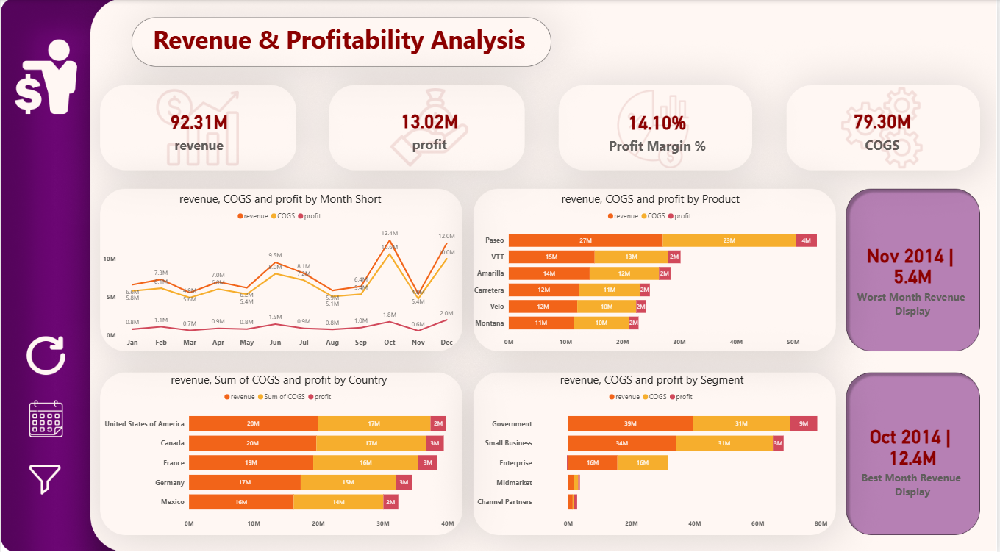

# 🚀 Revenue & Profitability Dashboard

This project presents a Power BI dashboard developed during the ITI Power BI course, focusing on transforming raw data into actionable insights.

## 📊 Overview
The dashboard analyzes:
- Revenue
- Profit
- Cost of Goods Sold (COGS)

It provides a clear view of performance across time, products, and regions.

## 🎯 Objectives
- Build an interactive dashboard
- Apply data storytelling principles
- Enable better business decision-making

## 🛠 Tools & Technologies
- Power BI
- DAX
- Figma (for UI/UX design)

## 💡 Key Features
- Dynamic interaction using **Bookmarks**
- Toggle between filters and visuals
- Clean and user-friendly interface

## ⏳ Time Intelligence
- Month-over-Month (MoM)
- Year-over-Year (YoY)
- Trend Analysis

## 📅 Data Modeling
- Created a custom **Dim_Date table using DAX**
- Built measures for accurate performance tracking

## 📸 Dashboard Preview

## ✨ Key Insights
- Best and worst performing months
- Revenue vs Profit vs COGS comparison
- Profitability trends over time

## 🙌 Acknowledgment
Special thanks to Eng. Mawada for her support throughout the ITI course.

## 📌 Author
Raneem Yasser  
